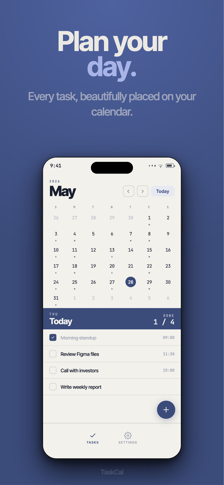
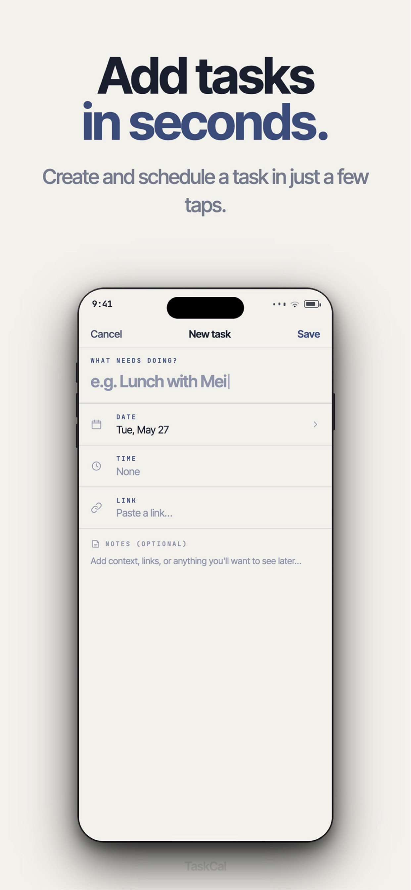
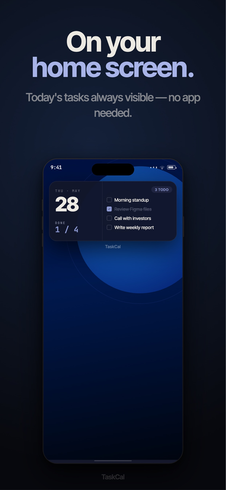

# TaskCal

A calendar-first task manager for iOS, built with React Native (Expo) and a
native Swift home-screen widget. Google SSO, Supabase backend, and full
localization in English, Traditional Chinese, and Spanish.

**🟢 Live on the App Store · v2.0.3**

📱 [Download on the App Store](https://apps.apple.com/us/app/taskcal-task-manager/id6753785239)

---

## Screenshots

| Calendar | Quick add | Home-screen widget |
|----------|-----------|--------------------|
|  |  |  |

## Tech Stack

| Layer | Tech |
|-------|------|
| Frontend | React Native 0.81.5 + Expo SDK 54 |
| Navigation | React Navigation (tabs + stack) |
| Backend | Supabase (Auth + PostgreSQL) |
| iOS Widget | Swift / WidgetKit (App Group shared storage) |
| Crash monitoring | Sentry + custom ErrorBoundary |
| Analytics | Mixpanel (iOS) + Google Analytics 4 (Web) |
| Ads | Google AdMob |
| Release tooling | Fastlane (App Store Connect metadata + screenshots) |
| Web Deploy | Vercel |

## Engineering Highlights

Things in this project that went beyond wiring up a CRUD app:

- **Native iOS widgets (home + lock screen)** — Swift/WidgetKit extensions that
  render today's tasks, a monthly calendar, and a circular progress ring. Data
  is bridged from React Native to the native process through an **App Group
  shared container**, kept in sync on every task add/complete/delete.
- **Optimistic UI with rollback** — task edits update local state instantly and
  reconcile against Supabase in the background, rolling back cleanly on failure.
- **Crash resilience** — a top-level `ErrorBoundary` plus Sentry reporting, so
  production crashes are captured instead of silently killing the app.
- **Full localization** — every UI string and all App Store metadata is shipped
  in 3 languages (en / zh-TW / es), with a no-hardcoded-string check before release.
- **End-to-end ship pipeline** — versioning, release notes, screenshots, and
  App Store Connect submission are scripted, with a git tag per submitted build
  for clean rollbacks.

## Project Structure

```
App.js                        # Entry point
src/
  components/                 # UI components
  services/                   # Business logic, API, widget sync
    widgetService.js           # Syncs data to the iOS widget via App Group storage
  locales/                    # i18n strings (en, zh-TW, es)
  config/                     # App configuration
ios/
  TaskCalWidget/              # Swift widget extension
docs/                         # Setup guides (Supabase, Xcode)
```

## Development

```bash
npm install
npm start          # Expo dev server
```

iOS Widget changes require an Xcode build of the widget target. See `docs/` for
Supabase and Xcode setup guides.

> Running this locally requires your own Supabase, AdMob, and analytics keys;
> the committed config is scrubbed of secrets.

## Version History

Full changelog for every release lives on the [GitHub Releases page](https://github.com/AlanChou890305/TaskCal/releases).

---

## About

TaskCal is a personal project I built to practice end-to-end React Native and
iOS native development — from design system to a shipped App Store release. It's
a free app, published mainly to go through the full build-and-ship workflow on a
real product rather than as a commercial venture.

> This repo is public for portfolio purposes. It is **not open for
> contributions**, and the code is not licensed for reuse.

## License

Private and proprietary. All rights reserved.
